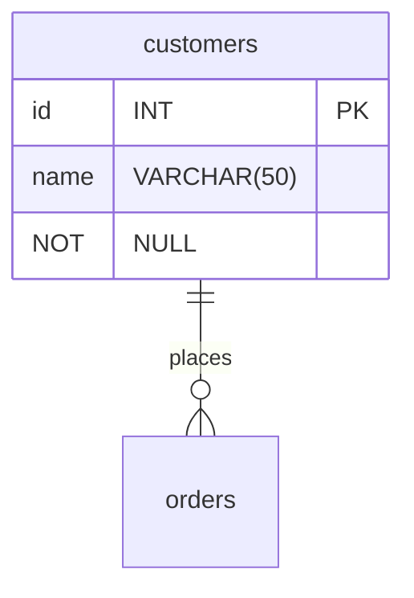

# Project Brief: E-Commerce Database

In this project, you will work with an e-commerce database. The database has products that consumers can buy from different suppliers. Customers can create an order and add several products in one order.

## Learning Objectives

- Use SQL queries to retrieve specific data from a database
- Draw a database schema to visualize relationships between tables
- Label database relationships defined by the `REFERENCES` keyword in `CREATE TABLE` commands

## Requirements

### Setup

To prepare your environment, open a terminal and create a new database called `cyf_ecommerce`:

```sql
createdb cyf_ecommerce
```

Import the file [`cyf_ecommerce.sql`](./cyf_ecommerce.sql) in your newly created database:

```sql
psql -d cyf_ecommerce -f cyf_ecommerce.sql
```

### Understand the schema

Open the file `cyf_ecommerce.sql` in VSCode and examine the SQL code. Take a piece of paper and draw the database with the different relationships between tables (as defined by the REFERENCES keyword in the CREATE TABLE commands). Identify the foreign keys and make sure you understand the full database schema.

Don't skip this step. You may one day [be asked at interview](https://monzo.com/blog/2022/03/23/demystifying-the-backend-engineering-interview-process) to draw a database schema. Sketching systems is a valuable skill for back end developers and worth practising. If you're interested in systems design, you may also want to take a course on Udemy.

You can even [draw relationship diagrams](https://mermaid.js.org/syntax/entityRelationshipDiagram.html) on [GitHub](https://docs.github.com/en/get-started/writing-on-github/working-with-advanced-formatting/creating-diagrams):



### Query Practice

Write SQL queries to complete the following tasks:

- [ ] List all the products whose name contains the word "socks"

<!-- SELECT * FROM products WHERE product_name LIKE '%socks%'; -->

id |   product_name   
----+------------------
  4 | Super warm socks

- [ ] List all the products which cost more than 100 showing product id, name, unit price, and supplier id
<!-- solution -->
SELECT products.id,products.product_name,product_availability.unit_price,product_availability.supp_id
FROM products
INNER JOIN order_items ON order_items.product_id = products.id
INNER JOIN product_availability ON product_availability.prod_id = products.id
WHERE product_availability.unit_price > 100;

id |  product_name  | unit_price | supp_id 
----+----------------+------------+---------
  1 | Mobile Phone X |        299 |       1
  1 | Mobile Phone X |        249 |       4
  1 | Mobile Phone X |        299 |       1
  1 | Mobile Phone X |        249 |       4

- [ ] List the 5 most expensive products
<!-- solution -->
SELECT * FROM product_availability
ORDER BY unit_price DESC
LIMIT 5;

prod_id | supp_id | unit_price 
---------+---------+------------
       1 |       1 |        299
       1 |       4 |        249
       2 |       2 |         41
       2 |       1 |         40
       2 |       3 |         39

- [ ] List all the products sold by suppliers based in the United Kingdom. The result should only contain the columns product_name and supplier_name
<!-- solution -->
SELECT p.product_name, s.supplier_name
FROM products p
JOIN order_items ON p.id = order_items.product_id
JOIN suppliers s ON  s.id = order_items.supplier_id
WHERE s.country = 'United Kingdom';

   product_name   | supplier_name 
------------------+---------------
 Super warm socks | Argos
 Le Petit Prince  | Sainsburys
 Coffee Cup       | Argos
 Javascript Book  | Argos
 Le Petit Prince  | Sainsburys
 Super warm socks | Sainsburys
 Super warm socks | Argos
 Mobile Phone X   | Sainsburys
 Ball             | Sainsburys

- [ ] List all orders, including order items, from customer named Hope Crosby
<!-- solution -->

SELECT order_id,product_id,supplier_id,quantity
FROM order_items oi INNER JOIN orders o ON (oi.order_id = o.id)
INNER JOIN customers c ON (o.customer_id = c.id)
WHERE c.name = 'Hope Crosby';

order_id | product_id | supplier_id | quantity 
----------+------------+-------------+----------
        4 |          1 |           1 |        1

- [ ] List all the products in the order ORD006. The result should only contain the columns product_name, unit_price, and quantity
<!-- solution -->

SELECT p.product_name, pa.unit_price,oi.quantity
FROM order_items oi INNER JOIN orders o ON (oi.order_id=o.id)
INNER JOIN products p ON (p.id=oi.product_id)
INNER JOIN product_availability pa ON (p.id=pa.prod_id)
WHERE o.order_reference = 'ORD006';

 product_name   | unit_price | quantity 
------------------+------------+----------
 Coffee Cup       |          3 |        3
 Coffee Cup       |          4 |        3
 Coffee Cup       |          4 |        3
 Coffee Cup       |          5 |        3
 Javascript Book  |         40 |        1
 Javascript Book  |         41 |        1
 Javascript Book  |         39 |        1
 Le Petit Prince  |         10 |        1
 Le Petit Prince  |         10 |        1
 Super warm socks |         10 |        3
 Super warm socks |          5 |        3

- [ ] List all the products with their supplier for all orders of all customers. The result should only contain the columns name (from customer), order_reference, order_date, product_name, supplier_name, and quantity

<!-- solution -->

SELECT c.name,o.order_reference,o.order_date,p.product_name,s.supplier_name,oi.quantity
FROM customers c INNER JOIN orders o ON (o.customer_id=c.id)
INNER JOIN order_items oi ON (oi.order_id=o.id)
INNER JOIN products p ON (p.id=oi.product_id)
INNER JOIN product_availability pa ON (p.id=pa.prod_id)
INNER JOIN suppliers s ON (pa.supp_id=s.id);

       name        | order_reference | order_date |      product_name       | supplier_name | quantity 
--------------------+-----------------+------------+-------------------------+---------------+----------
 Edan Higgins       | ORD008          | 2019-07-23 | Mobile Phone X          | Sainsburys    |        1
 Hope Crosby        | ORD004          | 2019-05-24 | Mobile Phone X          | Sainsburys    |        1
 Edan Higgins       | ORD008          | 2019-07-23 | Mobile Phone X          | Amazon        |        1
 Hope Crosby        | ORD004          | 2019-05-24 | Mobile Phone X          | Amazon        |        1
 Amber Tran         | ORD006          | 2019-07-05 | Javascript Book         | Taobao:

## Acceptance Criteria

- [ ] The `cyf_ecommerce` database is imported and set up correctly
- [ ] The database schema is drawn correctly to visualize relationships between tables
- [ ] The SQL queries retrieve the correct data according to the tasks listed above
- [ ] The pull request with the answers to the tasks is opened on the `main` branch of the `E-Commerce` repository
