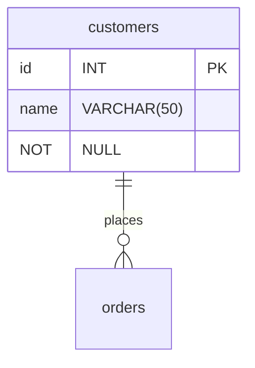

# Project Brief: E-Commerce Database

In this project, you will work with an e-commerce database. The database has products that consumers can buy from different suppliers. Customers can create an order and add several products in one order.

## Learning Objectives

- Use SQL queries to retrieve specific data from a database
- Draw a database schema to visualize relationships between tables
- Label database relationships defined by the `REFERENCES` keyword in `CREATE TABLE` commands

## Requirements

### Setup

To prepare your environment, open a terminal and create a new database called `cyf_ecommerce`:

```sql
createdb cyf_ecommerce
```

Import the file [`cyf_ecommerce.sql`](./cyf_ecommerce.sql) in your newly created database:

```sql
psql -d cyf_ecommerce -f cyf_ecommerce.sql
```

### Understand the schema

Open the file `cyf_ecommerce.sql` in VSCode and examine the SQL code. Take a piece of paper and draw the database with the different relationships between tables (as defined by the REFERENCES keyword in the CREATE TABLE commands). Identify the foreign keys and make sure you understand the full database schema.

Don't skip this step. You may one day [be asked at interview](https://monzo.com/blog/2022/03/23/demystifying-the-backend-engineering-interview-process) to draw a database schema. Sketching systems is a valuable skill for back end developers and worth practising. If you're interested in systems design, you may also want to take a course on Udemy.

You can even [draw relationship diagrams](https://mermaid.js.org/syntax/entityRelationshipDiagram.html) on [GitHub](https://docs.github.com/en/get-started/writing-on-github/working-with-advanced-formatting/creating-diagrams):



### Query Practice

Write SQL queries to complete the following tasks:

- [X] List all the products whose name contains the word "socks"
SELECT * FROM products WHERE product_name ILIKE '%socks%';
- [X] List all the products which cost more than 100 showing product id, name, unit price, and supplier id
select pr.id, product_name as name, unit_price as price, supp_id from products pr  join suppliers s on (pr.id=s.id) join product_availability p on (p.prod_id=pr.id) where unit_price>100;
- [X] List the 5 most expensive products
SELECT p.id, product_name,unit_price from products p JOIN product_availability pa ON (p.id=pa.prod_id) order by unit_price DESC limit 5;                                  
- [X] List all the products sold by suppliers based in the United Kingdom. The result should only contain the columns product_name and supplier_name
SELECT p.product_name, s.supplier_name FROM products p JOIN suppliers s ON p.id = s.id WHERE country = 'United Kingdom';
- [X] List all orders, including order items, from customer named Hope Crosby
SELECT * FROM orders o JOIN customers c ON o.id = c.id WHERE c.name = 'Hope Crosby';- [X] List all the products in the order ORD006. The result should only contain the columns product_name, unit_price, and quantity
SELECT product_name, unit_price, quantity FROM order_items o JOIN products p ON o.product_id = p.id JOIN product_availability pa ON pa.prod_id = o.product_id JOIN orders  ON orders.id = order_id WHERE order_reference = 'ORD006';
- [ ] List all the products with their supplier for all orders of all customers. The result should only contain the columns name (from customer), order_reference, order_date, product_name, supplier_name, and quantity
order_items
customers

## Acceptance Criteria

- [X] The `cyf_ecommerce` database is imported and set up correctly
- [X] The database schema is drawn correctly to visualize relationships between tables
- [X] The SQL queries retrieve the correct data according to the tasks listed above
- [X] The pull request with the answers to the tasks is opened on the `main` branch of the `E-Commerce` repository
