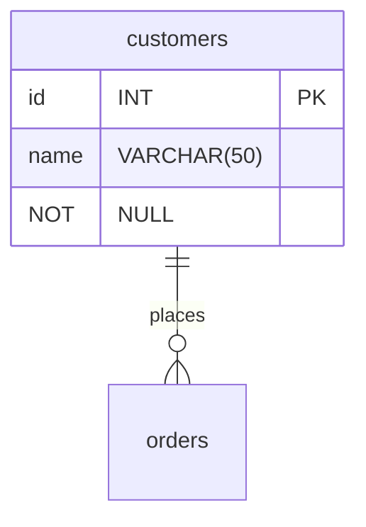

# Project Brief: E-Commerce Database

In this project, you will work with an e-commerce database. The database has products that consumers can buy from different suppliers. Customers can create an order and add several products in one order.

## Learning Objectives

- Use SQL queries to retrieve specific data from a database
- Draw a database schema to visualize relationships between tables
- Label database relationships defined by the `REFERENCES` keyword in `CREATE TABLE` commands

## Requirements

### Setup

To prepare your environment, open a terminal and create a new database called `cyf_ecommerce`:

```sql
createdb cyf_ecommerce
```

Import the file [`cyf_ecommerce.sql`](./cyf_ecommerce.sql) in your newly created database:

```sql
psql -d cyf_ecommerce -f cyf_ecommerce.sql
```

### Understand the schema

Open the file `cyf_ecommerce.sql` in VSCode and examine the SQL code. Take a piece of paper and draw the database with the different relationships between tables (as defined by the REFERENCES keyword in the CREATE TABLE commands). Identify the foreign keys and make sure you understand the full database schema.

Don't skip this step. You may one day [be asked at interview](https://monzo.com/blog/2022/03/23/demystifying-the-backend-engineering-interview-process) to draw a database schema. Sketching systems is a valuable skill for back end developers and worth practising. If you're interested in systems design, you may also want to take a course on Udemy.

You can even [draw relationship diagrams](https://mermaid.js.org/syntax/entityRelationshipDiagram.html) on [GitHub](https://docs.github.com/en/get-started/writing-on-github/working-with-advanced-formatting/creating-diagrams):



### Query Practice

Write SQL queries to complete the following tasks:
- [ ] List all the products whose name contains the word "socks"
```sql
select * from products where  product_name like '%socks%';
 id |   product_name
----+------------------
  4 | Super warm socks
(1 row)
```
- [ ] List all the products which cost more than 100 showing product id, name, unit price, and supplier id
```sql
select products.product_name,pa.supp_id,pa.prod_id,pa.unit_price from products INNER JOIN product_availability as pa ON products.id = pa.prod_id where pa.unit_price > 100;
  product_name  | supp_id | prod_id | unit_price
----------------+---------+---------+------------
 Mobile Phone X |       4 |       1 |        249
 Mobile Phone X |       1 |       1 |        299
(2 rows)
```
- [ ] List the 5 most expensive products
```sql
select p.product_name, pa.unit_price                                                                               from products as p inner join product_availability as pa on (p.id=pa.prod_id)                                                     order by unit_price desc limit 5;
  product_name   | unit_price
-----------------+------------
 Mobile Phone X  |        299
 Mobile Phone X  |        249
 Javascript Book |         41
 Javascript Book |         40
 Javascript Book |         39
(5 rows)
```
- [ ] List all the products sold by suppliers based in the United Kingdom. The result should only contain the columns product_name and supplier_name
```sql
select product_name ,supplier_name                                                                                 from product_availability as pa INNER JOIN products as p on (pa.prod_id = p.id)                                                   INNER JOIN suppliers as s on( s.id = pa.supp_id)                                                                                  where s.country='United Kingdom';
      product_name       | supplier_name
-------------------------+---------------
 Javascript Book         | Argos
 Super warm socks        | Argos
 Coffee Cup              | Argos
 Tee Shirt Olympic Games | Argos
 Mobile Phone X          | Sainsburys
 Le Petit Prince         | Sainsburys
 Super warm socks        | Sainsburys
 Coffee Cup              | Sainsburys
 Ball                    | Sainsburys
(9 rows)
```
- [ ] List all orders, including order items, from customer named Hope Crosby
```sql
select order_id,product_id, supplier_id, quantity                                                                  from customers as c INNER JOIN orders as o on (c.id =o.customer_id)                                                               INNER JOIN order_items as oi on (o.id = oi.order_id)                                                                              where name like 'Hope Crosby';
 order_id | product_id | supplier_id | quantity
----------+------------+-------------+----------
        4 |          1 |           1 |        1
(1 row)
```
- [ ] List all the products in the order ORD006. The result should only contain the columns product_name, unit_price, and quantity
```sql
 SELECT p.product_name, pa.unit_price, oi.quantity
cyf_ecommerc-# FROM orders as o
cyf_ecommerc-# INNER JOIN order_items oi ON o.id = oi.order_id
cyf_ecommerc-# INNER JOIN products as p ON oi.product_id = p.id
cyf_ecommerc-# INNER JOIN product_availability as pa ON p.id = pa.prod_id
cyf_ecommerc-# WHERE o.order_reference = 'ORD006';
   product_name   | unit_price | quantity
------------------+------------+----------
 Coffee Cup       |          3 |        3
 Coffee Cup       |          4 |        3
 Coffee Cup       |          4 |        3
 Coffee Cup       |          5 |        3
 Javascript Book  |         40 |        1
 Javascript Book  |         41 |        1
 Javascript Book  |         39 |        1
 Le Petit Prince  |         10 |        1
 Le Petit Prince  |         10 |        1
 Super warm socks |         10 |        3
 Super warm socks |          5 |        3
 Super warm socks |          8 |        3
 Super warm socks |         10 |        3
(13 rows)
```
- [ ] List all the products with their supplier for all orders of all customers. The result should only contain the columns name (from customer), order_reference, order_date, product_name, supplier_name, and quantity
```sql
SELECT c.name AS customer_name, o.order_reference, o.order_date, p.product_name, s.supplier_name, oi.quantity
cyf_ecommerc-# FROM customers c
cyf_ecommerc-# JOIN orders o ON c.id = o.customer_id
cyf_ecommerc-# JOIN order_items oi ON o.id = oi.order_id
cyf_ecommerc-# JOIN products p ON oi.product_id = p.id
cyf_ecommerc-# JOIN suppliers s ON oi.supplier_id = s.id;
   customer_name    | order_reference | order_date |      product_name       | supplier_name | quantity
--------------------+-----------------+------------+-------------------------+---------------+----------
 Guy Crawford       | ORD001          | 2019-06-01 | Tee Shirt Olympic Games | Taobao        |        1
 Guy Crawford       | ORD001          | 2019-06-01 | Super warm socks        | Taobao        |        5
 Guy Crawford       | ORD002          | 2019-07-15 | Super warm socks        | Argos         |        4
 Guy Crawford       | ORD002          | 2019-07-15 | Le Petit Prince         | Sainsburys    |        1
 Guy Crawford       | ORD003          | 2019-07-11 | Coffee Cup              | Argos         |       10
 Guy Crawford       | ORD003          | 2019-07-11 | Ball                    | Taobao        |        2
 Hope Crosby        | ORD004          | 2019-05-24 | Mobile Phone X          | Amazon        |        1
 Britanney Kirkland | ORD005          | 2019-05-30 | Javascript Book         | Argos         |        2
 Britanney Kirkland | ORD005          | 2019-05-30 | Le Petit Prince         | Amazon        |        1
 Amber Tran         | ORD006          | 2019-07-05 | Coffee Cup              | Taobao        |        3
 Amber Tran         | ORD006          | 2019-07-05 | Javascript Book         | Taobao        |        1
 Amber Tran         | ORD006          | 2019-07-05 | Le Petit Prince         | Sainsburys    |        1
 Amber Tran         | ORD006          | 2019-07-05 | Super warm socks        | Sainsburys    |        3
 Amber Tran         | ORD007          | 2019-04-05 | Super warm socks        | Argos         |       15
 Edan Higgins       | ORD008          | 2019-07-23 | Tee Shirt Olympic Games | Amazon        |        1
 Edan Higgins       | ORD008          | 2019-07-23 | Mobile Phone X          | Sainsburys    |        1
 Edan Higgins       | ORD009          | 2019-07-24 | Ball                    | Sainsburys    |        2
 Edan Higgins       | ORD010          | 2019-05-10 | Ball                    | Taobao        |        1
 Edan Higgins       | ORD010          | 2019-05-10 | Super warm socks        | Amazon        |        5
(19 rows)
```
## Acceptance Criteria
- [ ] The `cyf_ecommerce` database is imported and set up correctly
- [ ] The database schema is drawn correctly to visualize relationships between tables
- [ ] The SQL queries retrieve the correct data according to the tasks listed above
- [ ] The pull request with the answers to the tasks is opened on the `main` branch of the `E-Commerce` repository