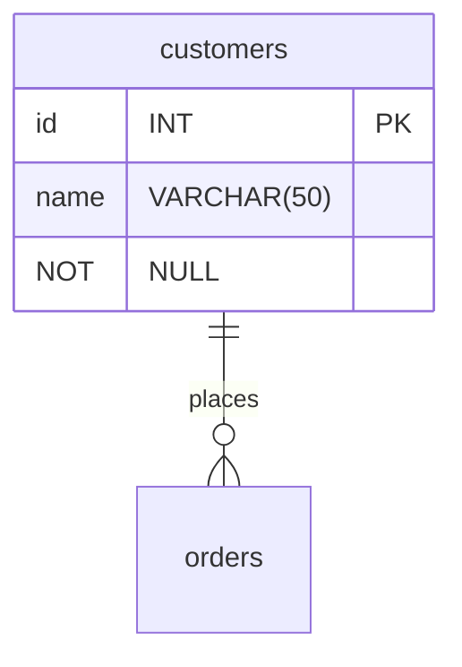

# Project Brief: E-Commerce Database

In this project, you will work with an e-commerce database. The database has products that consumers can buy from different suppliers. Customers can create an order and add several products in one order.

## Learning Objectives

- Use SQL queries to retrieve specific data from a database
- Draw a database schema to visualize relationships between tables
- Label database relationships defined by the `REFERENCES` keyword in `CREATE TABLE` commands

## Requirements

### Setup

To prepare your environment, open a terminal and create a new database called `cyf_ecommerce`:

```sql
createdb cyf_ecommerce
```

Import the file [`cyf_ecommerce.sql`](./cyf_ecommerce.sql) in your newly created database:

```sql
psql -d cyf_ecommerce -f cyf_ecommerce.sql
```

psql big-spender

### Understand the schema

Open the file `cyf_ecommerce.sql` in VSCode and examine the SQL code. Take a piece of paper and draw the database with the different relationships between tables (as defined by the REFERENCES keyword in the CREATE TABLE commands). Identify the foreign keys and make sure you understand the full database schema.

Don't skip this step. You may one day [be asked at interview](https://monzo.com/blog/2022/03/23/demystifying-the-backend-engineering-interview-process) to draw a database schema. Sketching systems is a valuable skill for back end developers and worth practising. If you're interested in systems design, you may also want to take a course on Udemy.

You can even [draw relationship diagrams](https://mermaid.js.org/syntax/entityRelationshipDiagram.html) on [GitHub](https://docs.github.com/en/get-started/writing-on-github/working-with-advanced-formatting/creating-diagrams):



### Query Practice

/
Write SQL queries to complete the following tasks:

- [ ] List all the products whose name contains the word "socks"
      SELECT \* FROM products
      WHERE product_name LIKE '%socks%';

      Diagram link to query 1: https://drive.google.com/file/d/1-01XnzYTWFBFMyA_kKhA6UvrJ-anLiXN/view?usp=sharing

- [ ] List all the products which cost more than 100 showing product id, name, unit price, and supplier id
      SELECT id AS product_id, product_name, unit_price, supp_id AS supplier_id
      FROM products
      JOIN product_availability ON id = prod_id
      WHERE unit_price > 100;
      <!-- SELECT id AS product_id, product_name, unit_price, supp_id AS supplier_id: This part of the query selects the columns you want to display in the result. It renames the "id" column from the "products" table as "product_id" and the "supp_id" column from the "product_availability" table as "supplier_id" for better readability. FROM products: This specifies that you're selecting data from the "products" table. JOIN product_availability ON id = prod_id: This performs an inner join between the "products" table and the "product_availability" table based on their respective IDs. The id column from the "products" table is matched with the prod_id column from the "product_availability" table. WHERE unit_price > 100: This filters the results to include only rows where the "unit_price" column from the "product_availability" table is greater than 100. -->

      Diagram link to query 2: https://drive.google.com/file/d/1hVbsw6rQ0ywqX3uw2hdtQMtB-QSCFRcs/view?usp=sharing

- [ ] List the 5 most expensive products
      select unit_price from product_availability
      order by unit_price DESC
      limit 5;
      <!-- SELECT unit_price: This part of the query selects the "unit_price" column from the "product_availability" table. It specifies that you want to retrieve the unit prices of products. FROM product_availability: This specifies that you're selecting data from the "product_availability" table. ORDER BY unit_price DESC: This orders the results in descending order based on the "unit_price" column. The DESC keyword stands for "descending." LIMIT 5: This limits the output to only the first 5 rows of the result. -->

      Diagram link to query 3: https://drive.google.com/file/d/1Rt4WaQnZV1y9rZ01Zv66pO1OY1yElj2n/view?usp=sharing

- [ ] List all the products sold by suppliers based in the United Kingdom. The result should only contain the columns product_name and supplier_name. In this answer i used aliases.
    SELECT product_name, supplier_name
    FROM products
    JOIN product_availability ON id = prod_id
    JOIN suppliers s ON supp_id = s.id
    WHERE country = 'United Kingdom';
<!-- SELECT specifies the columns I want to retrieve in the result. I am interested in the "product_name" from the "products" table and the "supplier_name" from the "suppliers" table.
FROM indicates the tables I am retrieving data from. I use data from three tables: "products," "product_availability," and "suppliers."
JOIN query uses two JOIN operations to combine data from multiple tables:
JOIN products ON id = prod_id: This joins the "products" table with the "product_availability" table. It matches rows where the "id" column in the "products" table is equal to the "prod_id" column in the "product_availability" table. This is how you associate products with their availability information.
JOIN suppliers s ON supp_id = s.id: This joins the combined result from the previous JOIN with the "suppliers" table. It matches rows where the "supp_id" column in the "product_availability" table is equal to the "id" column in the "suppliers" table. This is how you associate suppliers with the products.
WHERE filters the result based on a condition. I am interested in products where the "country" column in the "suppliers" table is equal to 'United Kingdom'. This filters the result to include only products available from suppliers based in the United Kingdom. -->

Diagram link on query 4: https://drive.google.com/file/d/1sDqZSZ8znMNKihS71hFBBj98CCYXwUN8/view?usp=sharing

- [ ] List all orders, including order items, from customer named Hope Crosby. In this answer I use aliases.
    SELECT name AS customer_name, p.product_name, oi.quantity
    FROM orders o
    JOIN customers c ON o.customer_id = c.id
    JOIN order_items oi ON o.id = oi.order_id
    JOIN products p ON oi.product_id = p.id
    WHERE name = 'Hope Crosby';
<!-- SELECT specifies the columns you want to retrieve in the result. I am interested in the following columns: customer_name: Alias for the customer's name, extracted from the name column in the customers table. product_name: The name of the product, extracted from the product_name column in the products table quantity: The quantity of the product ordered, extracted from the quantity column in the order_items table.
FROM is data from four tables: "orders," "customers," "order_items," and "products."

JOIN uses several JOIN operations to combine data from multiple tables: JOIN customers c ON o.customer_id = c.id: This joins the "orders" table with the "customers" table. It matches rows where the customer_id column in the "orders" table is equal to the id column in the "customers" table. This is how you associate orders with customers. JOIN order_items oi ON o.id = oi.order_id: This joins the combined result from the previous JOIN with the "order_items" table. It matches rows where the id column in the "orders" table is equal to the order_id column in the "order_items" table. This is how you associate orders with their items. JOIN products p ON oi.product_id = p.id: This joins the "order_items" table with the "products" table. It matches rows where the product_id column in the "order_items" table is equal to the id column in the "products" table. This is how you associate products with order items.

WHERE filters orders where the customer's name (name) is equal to 'Hope Crosby'. This filters the result to include only orders associated with the customer named "Hope Crosby."
-->

Diagram link on query 5; https://drive.google.com/file/d/1FS9kUc2DJ93l1RG7ORC_1XUS_ld7DSkV/view?usp=sharing

- [ ] List all the products in the order ORD006. The result should only contain the columns product_name, unit_price, and quantity. In this answer I used aliases.
      SELECT p.product_name, pa.unit_price, oi.quantity
      FROM order_items oi
      JOIN products p ON oi.product_id = p.id
      JOIN product_availability pa ON oi.product_id = pa.prod_id AND oi.supplier_id = pa.supp_id
      JOIN orders o ON oi.order_id = o.id
      WHERE o.order_reference = 'ORD006';

      Diagram on query 6 link: https://drive.google.com/file/d/1dFeyYFILuXlN773QgKy23fweOaQZS0ip/view?usp=sharing

- [ ] List all the products with their supplier for all orders of all customers. The result should only contain the columns name (from customer), order_reference, order_date, product_name, supplier_name, and quantity. In this answer I use aliases.
      SELECT c.name, o.order_reference, o.order_date, p.product_name, s.supplier_name, oi.quantity
      FROM customers c
      JOIN orders o ON c.id = o.customer_id
      JOIN order_items oi ON o.id = oi.order_id
      JOIN products p ON oi.product_id = p.id
      JOIN product_availability pa ON oi.product_id = pa.prod_id AND oi.supplier_id = pa.supp_id
      JOIN suppliers s ON pa.supp_id = s.id;

Diagram on query 7: https://drive.google.com/file/d/1WFaeFO7YThEUzYIowneJrcJqvac1f_bV/view?usp=sharing

The diagram represents the relationships between the tables involved in the SQL code. Here is the explanation of the diagram:

The "customers" table has a one-to-many relationship with the "orders" table. Each customer can have multiple orders, but each order belongs to a single customer.
The "orders" table has a one-to-many relationship with the "order_items" table. Each order can have multiple order items, but each order item belongs to a single order.
The "order_items" table has a many-to-one relationship with the "products" table. Each order item is associated with a single product, but each product can be associated with multiple order items.
The "order_items" table has a many-to-one relationship with the "suppliers" table. Each order item is associated with a single supplier, but each supplier can be associated with multiple order items.
The "order_items" table has a many-to-one relationship with the "product_availability" table. Each order item is associated with a single product availability, but each product availability can be associated with multiple order items.

## Acceptance Criteria

- [ ] The `cyf_ecommerce` database is imported and set up correctly
- [ ] The database schema is drawn correctly to visualize relationships between tables
- [ ] The SQL queries retrieve the correct data according to the tasks listed above
- [ ] The pull request with the answers to the tasks is opened on the `main` branch of the `E-Commerce` repository
