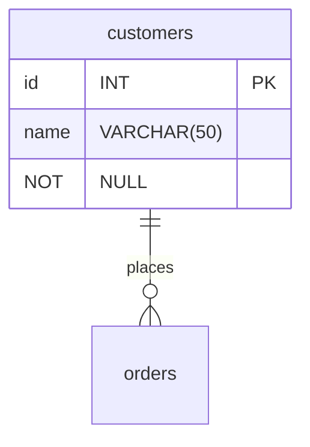

# Project Brief: E-Commerce Database

In this project, you will work with an e-commerce database. The database has products that consumers can buy from different suppliers. Customers can create an order and add several products in one order.

## Learning Objectives

- Use SQL queries to retrieve specific data from a database
- Draw a database schema to visualize relationships between tables
- Label database relationships defined by the `REFERENCES` keyword in `CREATE TABLE` commands

## Requirements

### Setup

To prepare your environment, open a terminal and create a new database called `cyf_ecommerce`:

```sql
createdb cyf_ecommerce
```

Import the file [`cyf_ecommerce.sql`](./cyf_ecommerce.sql) in your newly created database:

```sql
psql -d cyf_ecommerce -f cyf_ecommerce.sql
```

### Understand the schema

Open the file `cyf_ecommerce.sql` in VSCode and examine the SQL code. Take a piece of paper and draw the database with the different relationships between tables (as defined by the REFERENCES keyword in the CREATE TABLE commands). Identify the foreign keys and make sure you understand the full database schema.

Don't skip this step. You may one day [be asked at interview](https://monzo.com/blog/2022/03/23/demystifying-the-backend-engineering-interview-process) to draw a database schema. Sketching systems is a valuable skill for back end developers and worth practising. If you're interested in systems design, you may also want to take a course on Udemy.

You can even [draw relationship diagrams](https://mermaid.js.org/syntax/entityRelationshipDiagram.html) on [GitHub](https://docs.github.com/en/get-started/writing-on-github/working-with-advanced-formatting/creating-diagrams):



### Query Practice

Write SQL queries to complete the following tasks:

- [select * from products where lower(product_name) like '%socks%';] List all the products whose name contains the word "socks"
- [select p.id, p.product_name, pa.supp_id, pa.unit_price from products p inner join product_availability pa on(p.id=pa.prod_id) where unit_price > 100; ] List all the products which cost more than 100 showing product id, name, unit price, and supplier id
- [select p.id, p.product_name, pa.supp_id, pa.unit_price from products p inner join product_availability pa on(p.id=pa.prod_id) order by pa.unit_price desc limit 5; ] List the 5 most expensive products
- [ select s.supplier_name, p.product_name from suppliers s inner join order_items o on(s.id = o.supplier_id) inner join products p on(o.product_id=p.id) where country = 'United Kingdom';] List all the products sold by suppliers based in the United Kingdom. The result should only contain the columns product_name and supplier_name
- [ select * from customers c inner join orders o on(o.customer_id = c.id) inner join order_items oi on(oi.order_id=o.id) where c.name = 'Hope Crosby'; ] List all orders, including order items, from customer named Hope Crosby
- [ select p.unit_price, o.quantity, pr.product_name from product_availability p inner join products pr on(p.prod_id=pr.id) inner join order_items o on (pr.id = o.product_id) inner join orders on (orders.id = o.order_id) where orders.order_reference = 'ORD006'; ] List all the products in the order ORD006. The result should only contain the columns product_name, unit_price, and quantity
- [ select c.name, s.supplier_name, p.product_name, o.quantity, ord.order_reference, ord.order_date from suppliers s inner join order_items o on (s.id=o.supplier_id) inner join orders ord on (o.order_id=ord.id) inner join customers c on (c.id=ord.customer_id) inner join products p on (o.product_id=p.id);] List all the products with their supplier for all orders of all customers. The result should only contain the columns name (from customer), order_reference, order_date, product_name, supplier_name, and quantity

## Acceptance Criteria

- [ ] The `cyf_ecommerce` database is imported and set up correctly
- [ ] The database schema is drawn correctly to visualize relationships between tables
- [ ] The SQL queries retrieve the correct data according to the tasks listed above
- [ ] The pull request with the answers to the tasks is opened on the `main` branch of the `E-Commerce` repository
