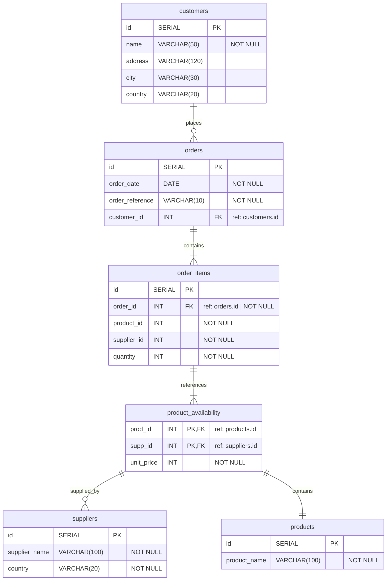

# Project Brief: E-Commerce Database

In this project, you will work with an e-commerce database. The database has products that consumers can buy from different suppliers. Customers can create an order and add several products in one order.

## Learning Objectives

- Use SQL queries to retrieve specific data from a database
- Draw a database schema to visualize relationships between tables
- Label database relationships defined by the `REFERENCES` keyword in `CREATE TABLE` commands

## Requirements

### Setup

To prepare your environment, open a terminal and create a new database called `cyf_ecommerce`:

```sql
createdb cyf_ecommerce
```

Import the file [`cyf_ecommerce.sql`](./cyf_ecommerce.sql) in your newly created database:

```sql
psql -d cyf_ecommerce -f cyf_ecommerce.sql
```

### Understand the schema

Open the file `cyf_ecommerce.sql` in VSCode and examine the SQL code. Take a piece of paper and draw the database with the different relationships between tables (as defined by the REFERENCES keyword in the CREATE TABLE commands). Identify the foreign keys and make sure you understand the full database schema.

Don't skip this step. You may one day [be asked at interview](https://monzo.com/blog/2022/03/23/demystifying-the-backend-engineering-interview-process) to draw a database schema. Sketching systems is a valuable skill for back end developers and worth practising. If you're interested in systems design, you may also want to take a course on Udemy.

You can even [draw relationship diagrams](https://mermaid.js.org/syntax/entityRelationshipDiagram.html) on [GitHub](https://docs.github.com/en/get-started/writing-on-github/working-with-advanced-formatting/creating-diagrams):



### Query Practice

Write SQL queries to complete the following tasks:

- [x] List all the products whose name contains the word "socks"

```sql
select * from products where lower(product_name) like lower('%socks%');
```

- [x] List all the products which cost more than 100 showing product id, name, unit price, and supplier id

```sql
select p.id, p.product_name, pa.unit_price, s.supplier_name
from products p
join product_availability pa ON p.id = pa.prod_id
join suppliers s ON s.id = pa.supp_id
where pa.unit_price > 100;
```

- [x] List the 5 most expensive products

```sql
select p.product_name, pa.unit_price
from products p
join product_availability pa on p.id = pa.prod_id
order by pa.unit_price desc
limit 5;
```

- [x] List all the products sold by suppliers based in the United Kingdom. The result should only contain the columns product_name and supplier_name

```sql
select p.product_name, s.supplier_name
from products p
join product_availability pa on p.id = pa.prod_id
join suppliers s on s.id = pa.supp_id
where LOWER(s.country) like '%united kingdom%';
```

- [x] List all orders, including order items, from customer named Hope Crosby

```sql
select o.id,
       o.order_date,
       o.order_reference,
       p.product_name,
       oi.quantity
from orders o
join order_items oi on o.id = oi.order_id
join products p on oi.product_id = p.id
join customers c on o.customer_id = c.id
where lower(c.name) like lower('Hope Crosby');
```

- [x] List all the products in the order ORD006. The result should only contain the columns product_name, unit_price, and quantity

```sql
select p.product_name, pa.unit_price, oi.quantity
from orders o
join order_items oi on o.id = oi.order_id
join products p on oi.product_id = p.id
join product_availability pa on oi.product_id = pa.prod_id and oi.supplier_id = pa.supp_id
where lower(o.order_reference) like lower('ORD006');

```

- [x] List all the products with their supplier for all orders of all customers. The result should only contain the columns name (from customer), order_reference, order_date, product_name, supplier_name, and quantity

```sql
select c.name, o.order_reference, o.order_date, p.product_name, s.supplier_name, oi.quantity
from orders o
join customers c on o.customer_id = c.id
join order_items oi on o.id = oi.order_id
join products p on oi.product_id = p.id
join product_availability pa on oi.product_id = pa.prod_id and oi.supplier_id = pa.supp_id
join suppliers s on oi.supplier_id = s.id
order by c.name, o.order_reference, p.product_name;
```

## Acceptance Criteria

- [x] The `cyf_ecommerce` database is imported and set up correctly
- [x] The database schema is drawn correctly to visualize relationships between tables
- [x] The SQL queries retrieve the correct data according to the tasks listed above
- [x] The pull request with the answers to the tasks is opened on the `main` branch of the `E-Commerce` repository
