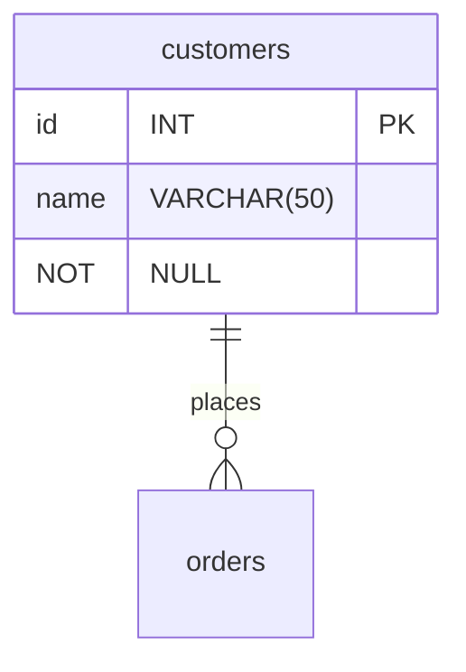

# Project Brief: E-Commerce Database

In this project, you will work with an e-commerce database. The database has products that consumers can buy from different suppliers. Customers can create an order and add several products in one order.

## Learning Objectives

- Use SQL queries to retrieve specific data from a database
- Draw a database schema to visualize relationships between tables
- Label database relationships defined by the `REFERENCES` keyword in `CREATE TABLE` commands

## Requirements

### Setup

To prepare your environment, open a terminal and create a new database called `cyf_ecommerce`:

```sql
createdb cyf_ecommerce
```

Import the file [`cyf_ecommerce.sql`](./cyf_ecommerce.sql) in your newly created database:

```sql
psql -d cyf_ecommerce -f cyf_ecommerce.sql
```

### Understand the schema

Open the file `cyf_ecommerce.sql` in VSCode and examine the SQL code. Take a piece of paper and draw the database with the different relationships between tables (as defined by the REFERENCES keyword in the CREATE TABLE commands). Identify the foreign keys and make sure you understand the full database schema.

Don't skip this step. You may one day [be asked at interview](https://monzo.com/blog/2022/03/23/demystifying-the-backend-engineering-interview-process) to draw a database schema. Sketching systems is a valuable skill for back end developers and worth practising. If you're interested in systems design, you may also want to take a course on Udemy.

You can even [draw relationship diagrams](https://mermaid.js.org/syntax/entityRelationshipDiagram.html) on [GitHub](https://docs.github.com/en/get-started/writing-on-github/working-with-advanced-formatting/creating-diagrams):



### Query Practice

Write SQL queries to complete the following tasks:

- [ ] List all the products whose name contains the word "socks"
      SELECT \* FROM products
      WHERE product_name LIKE '%socks%';
- [ ] List all the products which cost more than 100 showing product id, name, unit price, and supplier id
      SELECT id AS product_id, product_name, unit_price, supp_id AS supplier_id
      FROM products
      JOIN product_availability ON id = prod_id
      WHERE unit_price > 100;
      <!-- SELECT id AS product_id, product_name, unit_price, supp_id AS supplier_id: This part of the query selects the columns you want to display in the result. It renames the "id" column from the "products" table as "product_id" and the "supp_id" column from the "product_availability" table as "supplier_id" for better readability. FROM products: This specifies that you're selecting data from the "products" table. JOIN product_availability ON id = prod_id: This performs an inner join between the "products" table and the "product_availability" table based on their respective IDs. The id column from the "products" table is matched with the prod_id column from the "product_availability" table. WHERE unit_price > 100: This filters the results to include only rows where the "unit_price" column from the "product_availability" table is greater than 100. -->
- [ ] List the 5 most expensive products
      select unit_price from product_availability
      order by unit_price DESC
      limit 5;
      <!-- SELECT unit_price: This part of the query selects the "unit_price" column from the "product_availability" table. It specifies that you want to retrieve the unit prices of products. FROM product_availability: This specifies that you're selecting data from the "product_availability" table. ORDER BY unit_price DESC: This orders the results in descending order based on the "unit_price" column. The DESC keyword stands for "descending." LIMIT 5: This limits the output to only the first 5 rows of the result. -->
- [ ] List all the products sold by suppliers based in the United Kingdom. The result should only contain the columns product_name and supplier_name
- [ ] List all orders, including order items, from customer named Hope Crosby
- [ ] List all the products in the order ORD006. The result should only contain the columns product_name, unit_price, and quantity
- [ ] List all the products with their supplier for all orders of all customers. The result should only contain the columns name (from customer), order_reference, order_date, product_name, supplier_name, and quantity

## Acceptance Criteria

- [ ] The `cyf_ecommerce` database is imported and set up correctly
- [ ] The database schema is drawn correctly to visualize relationships between tables
- [ ] The SQL queries retrieve the correct data according to the tasks listed above
- [ ] The pull request with the answers to the tasks is opened on the `main` branch of the `E-Commerce` repository
