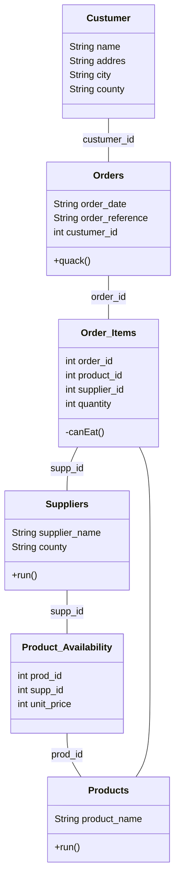

Relationship diagram

```mermaid
classDiagram
    Custumer -- Orders : custumer_id
    Orders -- Order_Items : order_id
    Order_Items -- Suppliers : supp_id
    Suppliers -- Product_Availability : supp_id
    Product_Availability -- Products : prod_id
    Products -- Order_Items
    Custumer : String name
    Custumer : String addres
    Custumer : String city
    Custumer : String county

    class Orders{
        String order_date
        String order_reference
        int custumer_id
        +quack()
    }
    class Order_Items{
        int order_id
        int product_id
        int supplier_id
        int quantity
        -canEat()
    }
    class Suppliers{
        String supplier_name
        String county
        +run()
    }
    class Product_Availability{
        int prod_id
        int supp_id
        int unit_price
    }
    class Products{
        String product_name
        +run()
    }

```
